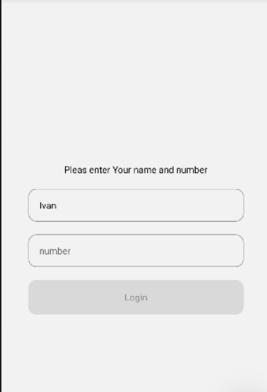
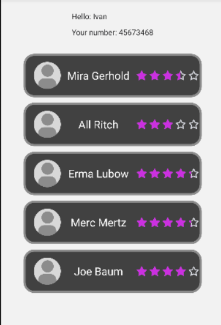

# Barber Booking App ✂️

A simple React Native application for booking barber services.  
Users can register with their details, view available masters, and see detailed information about each master.

---

## 📸 Screenshots
- User Registration Screen

- Client Profile & Masters List

- Master Detail Page

---

## 🛠 Features
- User registration with personal data (name, phone number).
- Client profile page displaying entered information.
- List of barbers with ratings and availability status.
- Detail page for each master with description and additional info.
- Navigation using React Navigation (Tabs + Stack + Drawer).
- API integration for fetching masters.

---

## 📄 Pages

### 📝 User Registration
A screen where the user enters their personal data (name and phone number).  
This data is then saved and used to identify the client when booking a haircut.

### 👤 Client Profile & Masters List
Displays the client’s personal information at the top.  
Below, the user can see a list of masters (barbers) with their names, ratings, and availability status.

### ⭐ Master Detail
Shows detailed information about a specific master.  
Includes description, rating, and any additional info to help the user choose the right barber.

---

## 🚀 Installation & Running

```bash
# Clone the repository
git clone https://github.com/thisIvanRepo/barber-booking-app.git
cd barber-booking-app

# Install dependencies
npm install

# Start Metro bundler
npm start

# Run on Android
press '-a'
